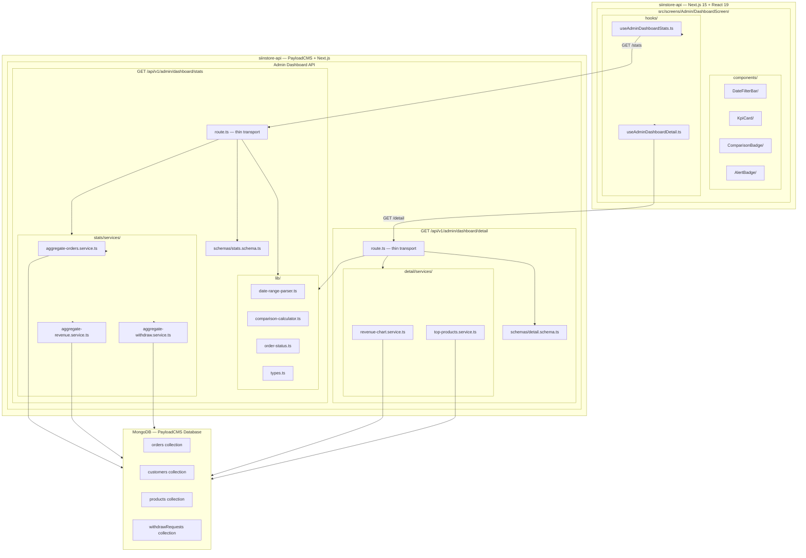

# Design Master — Admin Dashboard Feature

> **Status**: Approved
> **Version**: 1.0.0
> **Last Updated**: 2026-03-21

---

## 1. Problem Recap

Admin Dashboard hiện tại sử dụng **15 lời gọi `payload.count()`** để lấy stats — mỗi count là một round-trip riêng biệt tới MongoDB. Điều này tạo ra:

- **Performance bottleneck**: 15 network round-trips cho một trang dashboard
- **Không có Comparison**: Không có So sánh với kỳ trước (WoW/MoM/YoY)
- **Revenue logic sai**: `delivered + completed` thay vì `confirmed → completed`
- **Hold orders bị tính sai**: Orders đang dispute (hold) vẫn được đưa vào stats
- **Stats endpoint nặng**: Không phân biệt stats (all-time) vs detail (date-filtered)
- **Không có date range filter**: Chỉ hỗ trợ year/month cứng

**Mục tiêu thiết kế**: Tái cấu trúc thành 2 endpoint riêng biệt, dùng aggregation pipelines thay vì count, hỗ trợ date range linh hoạt và comparison period.

---

## 2. Solution Overview

Thiết kế tách biệt Dashboard thành **2 endpoint chuyên biệt** và **6 KPI Tier 1 cố định**:

| Endpoint | Mục đích | Cache |
|----------|----------|-------|
| `GET /api/v1/admin/dashboard/stats` | 6 KPIs + comparison | max-age=30s |
| `GET /api/v1/admin/dashboard/detail` | Revenue chart + Top products | max-age=60s |

**6 KPIs Tier 1** (luôn hiển thị, không đổi):
1. `revenue` — Tổng doanh thu đã xác nhận
2. `totalOrders` — Tổng số đơn hàng
3. `newCustomers` — Khách hàng mới trong kỳ
4. `aov` — Average Order Value
5. `pendingOrders` — Đơn hàng đang chờ xử lý
6. `completionRate` — Tỷ lệ hoàn thành

---

## 3. Architecture Diagram



---

## 4. Component Breakdown

### 4.1 Backend Components

| Component | Type | File | Mô tả |
|-----------|------|------|-------|
| `DateRangeParser` | Utility | `lib/date-range-parser.ts` | Parse preset/custom date range → `{ from, to, spanDays, preset }` |
| `ComparisonCalculator` | Utility | `lib/comparison-calculator.ts` | Tính WoW/MoM/YoY từ current vs prev period |
| `OrderStatus` | Constants | `lib/order-status.ts` | Trạng thái order constants |
| `AggregateOrdersService` | Service | `stats/services/aggregate-orders.service.ts` | Aggregation orders + new customers |
| `AggregateRevenueService` | Service | `stats/services/aggregate-revenue.service.ts` | Aggregation revenue (item-level) + commission |
| `AggregateWithdrawService` | Service | `stats/services/aggregate-withdraw.service.ts` | Aggregation withdraw requests |
| `RevenueChartService` | Service | `detail/services/revenue-chart.service.ts` | Revenue theo granularity (day/week/month) |
| `TopProductsService` | Service | `detail/services/top-products.service.ts` | Top selling products |
| `StatsRoute` | Route | `stats/route.ts` | Thin transport — stats endpoint |
| `DetailRoute` | Route | `detail/route.ts` | Thin transport — detail endpoint |

### 4.2 Frontend Components

| Component | Type | File | Mô tả |
|-----------|------|------|-------|
| `DateFilterBar` | UI | `components/DateFilterBar/DateFilterBar.tsx` | 14 presets + custom date picker |
| `KpiCard` | UI | `components/KpiCard/KpiCard.tsx` | Base KPI card wrapper |
| `KpiCardRevenue` | UI | `components/KpiCard/KpiCardRevenue.tsx` | Revenue KPI |
| `KpiCardOrders` | UI | `components/KpiCard/KpiCardOrders.tsx` | Total orders KPI |
| `KpiCardNewCustomers` | UI | `components/KpiCard/KpiCardNewCustomers.tsx` | New customers KPI |
| `KpiCardAov` | UI | `components/KpiCard/KpiCardAov.tsx` | AOV KPI |
| `KpiCardPending` | UI | `components/KpiCard/KpiCardPending.tsx` | Pending orders KPI |
| `KpiCardCompletionRate` | UI | `components/KpiCard/KpiCardCompletionRate.tsx` | Completion rate KPI |
| `ComparisonBadge` | UI | `components/ComparisonBadge/ComparisonBadge.tsx` | Hiển thị % thay đổi vs kỳ trước |
| `AlertBadge` | UI | `components/AlertBadge/AlertBadge.tsx` | Cảnh báo threshold |
| `useAdminDashboardStats` | Hook | `hooks/useAdminDashboardStats.ts` | Fetch stats + comparison data |
| `useAdminDashboardDetail` | Hook | `hooks/useAdminDashboardDetail.ts` | Fetch chart + top products |

---

## 5. Technology Decisions

### 5.1 Aggregation Pipelines vs Count

**Quyết định**: Dùng MongoDB aggregation `$match` + `$group` thay vì nhiều `payload.count()` riêng biệt.

**Lý do**:
- Giảm từ 15 round-trips xuống còn 3 aggregation calls (orders, revenue, withdraw)
- Một aggregation có thể trả về nhiều metrics cùng lúc
- `$facet` cho phép chạy nhiều pipelines song song trong một query

**Trade-off**:
- Aggregation phức tạp hơn count đơn giản
- Cần viết migration cho indexes
- Pipeline phải được validated cẩn thận

### 5.2 Date Parsing

**Quyết định**: Dùng `new Date(year, month - 1, day)` thay vì `new Date(dateString)`.

**Lý do**: Tránh UTC shift — `new Date('2026-03-01')` sẽ tạo UTC midnight, không phải local midnight. Dùng constructor 3 args để đảm bảo giờ local.

```typescript
// Sai — UTC shift
const from = new Date(`${year}-${month}-${day}`)

// Đúng — Local time
const from = new Date(year, month - 1, day)
```

### 5.3 Comparison: Immediately Preceding Period

**Quyết định**: So sánh với kỳ ngay trước có cùng span.

```
currentFrom = 2026-03-01, currentTo = 2026-03-21, spanDays = 20
prevFrom    = 2026-02-09, prevTo    = 2026-03-01
prevStart   = currentFrom - spanDays = 2026-03-01 - 20 days
```

**Không dùng**: Fixed month/year comparison (sẽ không chính xác với custom ranges).

### 5.4 Hold Mechanism

**Quyết định**: Hold orders bị **excluded hoàn toàn** khỏi stats và revenue.

**Lý do**: Tranh chấp chưa resolved → tiền chưa vào wallet chủ shop → không tính vào doanh thu.

**Implementation**: Filter `status.hold: { $ne: true }` trong tất cả aggregation pipelines.

### 5.5 Revenue: confirmed → completed

**Quyết định**: Chỉ tính orders có `status: 'confirmed'` làm revenue.

**Lý do**: Đây là thời điểm tiền thực sự được xác nhận (đã giao hàng thành công, không dispute). Không dùng `delivered + completed` như store-dashboard.

---

## 6. Risk Assessment

| Risk | Severity | Likelihood | Mitigation |
|------|----------|------------|------------|
| Aggregation pipeline chậm trên collection lớn | HIGH | MEDIUM | Tạo compound indexes + migration script |
| UTC shift gây sai date range | HIGH | LOW | Dùng `new Date(y, m-1, d)` consistently |
| Hold orders bị tính nhầm vào revenue | CRITICAL | LOW | Filter `{ 'status.hold': { $ne: true } }` ở mọi pipeline |
| 6 KPIs cố định không đủ flexibility | MEDIUM | LOW | Có thể mở rộng Tier 2/3 sau |
| Cache stale data quá 30s | LOW | MEDIUM | `max-age=30` cho stats, `max-age=60` cho detail |
| MongoDB aggregation syntax sai | HIGH | MEDIUM | Validate pipelines trong migration script |
| Frontend re-fetch quá nhiều khi date thay đổi | LOW | MEDIUM | Debounce date filter (300ms) |

---

## 7. Component Architecture Links

| Design Document | File | Chủ đề |
|-----------------|------|--------|
| **API Contract** | `design.component.api.md` | Endpoints, schemas, RBAC, cache headers, error codes |
| **Frontend UI** | `design.component.frontend.md` | DateFilterBar, KPI cards, badges, hooks, state |
| **Database** | `design.component.database.md` | Aggregation pipelines, indexes, migration script |
| **Service Layer** | `design.component.service.md` | Business logic cho từng service |
| **Business Logic** | `design.component.business.md` | Revenue, comparison, alerts, hold, completion rate |
