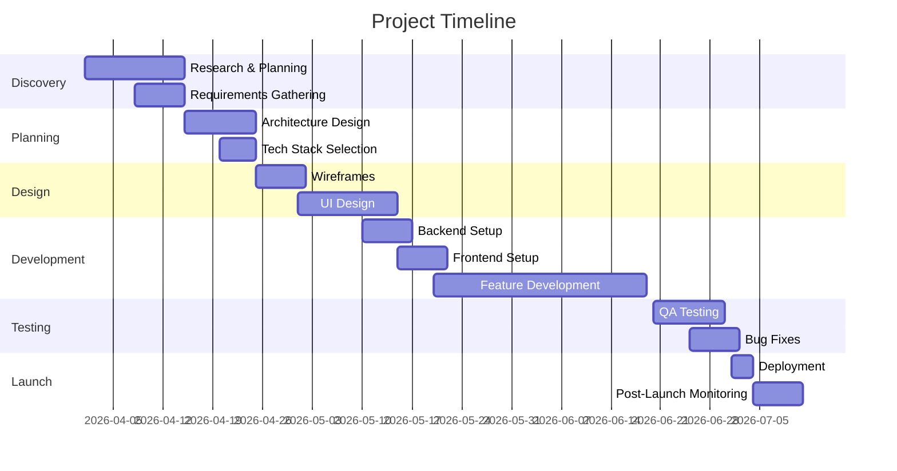

# Project Milestone & Roadmap

> **Template cho việc lập kế hoạch milestone và roadmap dự án**
> **Nguồn**: Trích xuất từ Cursor Agent, Windsurf, Antigravity Planning Mode

---

## Project Overview

| Field | Value |
|-------|-------|
| **Project Name** | [Tên dự án] |
| **Project Type** | [Web App / Mobile App / API / Full-stack] |
| **Start Date** | [YYYY-MM-DD] |
| **Target Launch** | [YYYY-MM-DD] |
| **Project Manager** | [Tên] |
| **Team Size** | [Số người] |

---

## Project Phases

---

## Milestone Breakdown

### Phase 1: Discovery (Week 1-2)

**Duration**: 2 weeks
**Goal**: Understand requirements and validate project feasibility

#### Milestone 1.1: Requirements Complete
**Due Date**: [YYYY-MM-DD]
**Owner**: [Name]

**Deliverables**:
- [ ] Project brief document
- [ ] User personas (3-5)
- [ ] User stories (20-30)
- [ ] Competitive analysis
- [ ] Feature prioritization matrix

**Success Criteria**:
- ✅ All stakeholders approve requirements
- ✅ User personas validated with target audience
- ✅ Feature list prioritized (Must-have, Should-have, Nice-to-have)

**Dependencies**: None

**Risks**:
- Unclear requirements → Mitigation: Weekly stakeholder meetings
- Scope creep → Mitigation: Strict change request process

---

#### Milestone 1.2: Technical Feasibility
**Due Date**: [YYYY-MM-DD]
**Owner**: [Name]

**Deliverables**:
- [ ] Technical feasibility report
- [ ] Risk assessment document
- [ ] Proof of concept (if needed)
- [ ] Budget estimation

**Success Criteria**:
- ✅ All technical risks identified
- ✅ POC demonstrates key functionality
- ✅ Budget approved by stakeholders

**Dependencies**: Milestone 1.1

**Risks**:
- Technical limitations → Mitigation: Early POC development
- Budget constraints → Mitigation: Phased approach

---

### Phase 2: Planning (Week 3-4)

**Duration**: 2 weeks
**Goal**: Design architecture and plan implementation

#### Milestone 2.1: Architecture Defined
**Due Date**: [YYYY-MM-DD]
**Owner**: [Name]

**Deliverables**:
- [ ] Architecture Decision Records (ADRs)
- [ ] System architecture diagram
- [ ] Database schema design
- [ ] API specification
- [ ] Tech stack decision document

**Success Criteria**:
- ✅ Architecture reviewed by senior engineers
- ✅ All ADRs approved
- ✅ Database schema normalized
- ✅ API endpoints documented

**Dependencies**: Milestone 1.2

**Risks**:
- Over-engineering → Mitigation: YAGNI principle
- Wrong tech choices → Mitigation: Spike solutions

---

#### Milestone 2.2: Project Plan Complete
**Due Date**: [YYYY-MM-DD]
**Owner**: [Name]

**Deliverables**:
- [ ] Detailed project timeline
- [ ] Sprint planning (if Agile)
- [ ] Resource allocation plan
- [ ] Risk mitigation strategies
- [ ] Communication plan

**Success Criteria**:
- ✅ Timeline approved by all teams
- ✅ Resources allocated
- ✅ Risks documented with mitigation plans

**Dependencies**: Milestone 2.1

**Risks**:
- Unrealistic timeline → Mitigation: Buffer time (20%)
- Resource conflicts → Mitigation: Early resource booking

---

### Phase 3: Design (Week 5-7)

**Duration**: 3 weeks
**Goal**: Create visual design and user experience

#### Milestone 3.1: Wireframes Approved
**Due Date**: [YYYY-MM-DD]
**Owner**: [Name]

**Deliverables**:
- [ ] Low-fidelity wireframes (all pages)
- [ ] User flow diagrams
- [ ] Information architecture
- [ ] Sitemap
- [ ] Interactive prototype

**Success Criteria**:
- ✅ Wireframes approved by stakeholders
- ✅ User flows validated with users
- ✅ Prototype tested with 5+ users

**Dependencies**: Milestone 2.2

**Risks**:
- Design revisions → Mitigation: Early user testing
- Stakeholder disagreements → Mitigation: Design workshops

---

#### Milestone 3.2: UI Design Complete
**Due Date**: [YYYY-MM-DD]
**Owner**: [Name]

**Deliverables**:
- [ ] High-fidelity mockups (all pages)
- [ ] Design system / style guide
- [ ] Component library (Figma/Sketch)
- [ ] Responsive designs (mobile, tablet, desktop)
- [ ] Design handoff documentation

**Success Criteria**:
- ✅ All mockups approved
- ✅ Design system documented
- ✅ Accessibility standards met (WCAG 2.1 AA)
- ✅ Developers can implement from designs

**Dependencies**: Milestone 3.1

**Risks**:
- Design-dev disconnect → Mitigation: Daily design-dev sync
- Accessibility issues → Mitigation: Accessibility audit

---

### Phase 4: Development (Week 8-14)

**Duration**: 7 weeks
**Goal**: Build the application

#### Milestone 4.1: Development Environment Ready
**Due Date**: [YYYY-MM-DD]
**Owner**: [Name]

**Deliverables**:
- [ ] Development environment setup
- [ ] CI/CD pipeline configured
- [ ] Code repository initialized
- [ ] Development standards documented
- [ ] Testing framework setup

**Success Criteria**:
- ✅ All developers can run project locally
- ✅ CI/CD pipeline runs successfully
- ✅ Code standards enforced (linting, formatting)

**Dependencies**: Milestone 3.2

**Risks**:
- Environment issues → Mitigation: Docker containers
- CI/CD failures → Mitigation: Incremental setup

---

#### Milestone 4.2: Backend MVP Complete
**Due Date**: [YYYY-MM-DD]
**Owner**: [Name]

**Deliverables**:
- [ ] Database setup and migrations
- [ ] Authentication system
- [ ] Core API endpoints
- [ ] API documentation
- [ ] Unit tests (80% coverage)

**Success Criteria**:
- ✅ All MVP endpoints functional
- ✅ API documentation complete
- ✅ Tests passing
- ✅ Performance benchmarks met

**Dependencies**: Milestone 4.1

**Risks**:
- Database performance → Mitigation: Early load testing
- API design changes → Mitigation: Versioned APIs

---

#### Milestone 4.3: Frontend MVP Complete
**Due Date**: [YYYY-MM-DD]
**Owner**: [Name]

**Deliverables**:
- [ ] Component library implemented
- [ ] Core pages/screens
- [ ] API integration
- [ ] State management
- [ ] Responsive layouts

**Success Criteria**:
- ✅ All MVP pages functional
- ✅ Design matches mockups
- ✅ Mobile responsive
- ✅ No console errors

**Dependencies**: Milestone 4.2

**Risks**:
- Design implementation gaps → Mitigation: Design QA
- Performance issues → Mitigation: Performance monitoring

---

#### Milestone 4.4: Feature Complete
**Due Date**: [YYYY-MM-DD]
**Owner**: [Name]

**Deliverables**:
- [ ] All planned features implemented
- [ ] Integration tests
- [ ] Error handling
- [ ] Loading states
- [ ] Edge cases handled

**Success Criteria**:
- ✅ All user stories completed
- ✅ Acceptance criteria met
- ✅ Code reviewed and merged
- ✅ No critical bugs

**Dependencies**: Milestone 4.3

**Risks**:
- Feature creep → Mitigation: Strict scope control
- Technical debt → Mitigation: Refactoring sprints

---

### Phase 5: Testing (Week 15-17)

**Duration**: 3 weeks
**Goal**: Ensure quality and fix bugs

#### Milestone 5.1: QA Testing Complete
**Due Date**: [YYYY-MM-DD]
**Owner**: [Name]

**Deliverables**:
- [ ] Test plan executed
- [ ] Bug reports documented
- [ ] Regression testing
- [ ] Performance testing
- [ ] Security audit

**Success Criteria**:
- ✅ All test cases executed
- ✅ No critical bugs
- ✅ Performance targets met
- ✅ Security vulnerabilities addressed

**Dependencies**: Milestone 4.4

**Risks**:
- Too many bugs → Mitigation: Earlier testing
- Performance issues → Mitigation: Optimization sprint

---

#### Milestone 5.2: User Acceptance Testing (UAT)
**Due Date**: [YYYY-MM-DD]
**Owner**: [Name]

**Deliverables**:
- [ ] UAT plan
- [ ] User testing sessions
- [ ] Feedback incorporated
- [ ] Final bug fixes
- [ ] UAT sign-off

**Success Criteria**:
- ✅ Users can complete key tasks
- ✅ User satisfaction score > 4/5
- ✅ All critical feedback addressed
- ✅ Stakeholders approve for launch

**Dependencies**: Milestone 5.1

**Risks**:
- User confusion → Mitigation: Onboarding improvements
- Last-minute changes → Mitigation: Change freeze policy

---

### Phase 6: Launch (Week 18-19)

**Duration**: 2 weeks
**Goal**: Deploy to production and monitor

#### Milestone 6.1: Production Deployment
**Due Date**: [YYYY-MM-DD]
**Owner**: [Name]

**Deliverables**:
- [ ] Production environment setup
- [ ] Database migration
- [ ] Application deployment
- [ ] DNS configuration
- [ ] SSL certificates
- [ ] Monitoring setup

**Success Criteria**:
- ✅ Application accessible in production
- ✅ All services running
- ✅ Monitoring alerts configured
- ✅ Backup systems in place

**Dependencies**: Milestone 5.2

**Risks**:
- Deployment failures → Mitigation: Rollback plan
- Downtime → Mitigation: Blue-green deployment

---

#### Milestone 6.2: Post-Launch Stabilization
**Due Date**: [YYYY-MM-DD]
**Owner**: [Name]

**Deliverables**:
- [ ] 24/7 monitoring (first week)
- [ ] Hotfix deployments (if needed)
- [ ] Performance optimization
- [ ] User feedback collection
- [ ] Post-launch report

**Success Criteria**:
- ✅ Uptime > 99.9%
- ✅ No critical bugs in production
- ✅ Performance metrics met
- ✅ Positive user feedback

**Dependencies**: Milestone 6.1

**Risks**:
- Production bugs → Mitigation: Hotfix process
- Performance degradation → Mitigation: Scaling plan

---

## Sprint Planning (Agile)

### Sprint Structure
- **Sprint Duration**: 2 weeks
- **Sprint Planning**: Monday (2 hours)
- **Daily Standup**: Every day (15 minutes)
- **Sprint Review**: Friday (1 hour)
- **Sprint Retrospective**: Friday (1 hour)

### Sprint Breakdown

#### Sprint 1-2: Discovery & Planning
- Requirements gathering
- Architecture design
- Tech stack selection

#### Sprint 3-4: Design
- Wireframes
- UI design
- Design system

#### Sprint 5-7: Backend Development
- Database setup
- Authentication
- Core APIs

#### Sprint 8-10: Frontend Development
- Component library
- Core pages
- API integration

#### Sprint 11-12: Feature Development
- Additional features
- Integration
- Polish

#### Sprint 13-14: Testing & Launch
- QA testing
- Bug fixes
- Deployment

---

## Resource Allocation

### Team Structure

| Role | Name | Allocation | Phases |
|------|------|------------|--------|
| **Project Manager** | [Name] | 100% | All |
| **Tech Lead** | [Name] | 100% | 2-6 |
| **Backend Developer** | [Name] | 100% | 4-5 |
| **Frontend Developer** | [Name] | 100% | 4-5 |
| **UI/UX Designer** | [Name] | 100% | 3 |
| **QA Engineer** | [Name] | 100% | 5 |
| **DevOps Engineer** | [Name] | 50% | 4, 6 |

---

## Risk Management

### High-Priority Risks

| Risk | Impact | Probability | Mitigation | Owner |
|------|--------|-------------|------------|-------|
| Scope creep | High | High | Change control process | PM |
| Technical debt | High | Medium | Code reviews, refactoring | Tech Lead |
| Resource unavailability | High | Low | Cross-training, backup resources | PM |
| Third-party API issues | Medium | Medium | Fallback solutions, caching | Backend Dev |
| Performance issues | High | Medium | Early load testing, optimization | Tech Lead |

---

## Communication Plan

### Stakeholder Updates
- **Frequency**: Weekly
- **Format**: Email + Dashboard
- **Content**: Progress, blockers, next steps

### Team Meetings
- **Daily Standup**: 15 min (9:00 AM)
- **Sprint Planning**: 2 hours (Monday)
- **Sprint Review**: 1 hour (Friday)
- **Retrospective**: 1 hour (Friday)

### Status Reports
- **Weekly**: Progress report to stakeholders
- **Monthly**: Executive summary
- **Ad-hoc**: Critical issues

---

## Success Metrics

### Launch Metrics
- [ ] On-time delivery (within 5% of timeline)
- [ ] On-budget delivery (within 10% of budget)
- [ ] Zero critical bugs at launch
- [ ] User satisfaction > 4/5

### Post-Launch Metrics (30 days)
- [ ] Uptime > 99.9%
- [ ] Page load time < 2 seconds
- [ ] User retention > 40%
- [ ] Conversion rate > 5%

---

## Contingency Plans

### If Behind Schedule
1. Prioritize must-have features
2. Move nice-to-have features to Phase 2
3. Add resources (if budget allows)
4. Extend timeline (last resort)

### If Over Budget
1. Review scope for cuts
2. Negotiate with vendors
3. Seek additional funding
4. Reduce team size (last resort)

### If Critical Bug Found
1. Assess severity and impact
2. Create hotfix branch
3. Fast-track testing
4. Deploy emergency patch
5. Post-mortem analysis

---

**Created**: 2026-04-22
**Last Updated**: 2026-04-22
**Next Review**: [YYYY-MM-DD]
**Approved By**: [Names]
