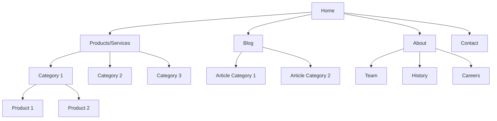
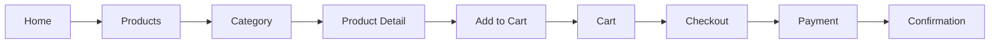
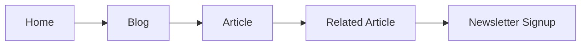

# Website Sitemap & Information Architecture

> **Template cho việc thiết kế cấu trúc thông tin và sitemap**
> **Nguồn**: Trích xuất từ v0, Lovable, Web Design Best Practices

---

## Project Information

| Field | Value |
|-------|-------|
| **Project Name** | [Tên dự án] |
| **Website Type** | [E-commerce / Blog / Portfolio / SaaS / Corporate] |
| **Target Audience** | [Mô tả audience] |
| **Primary Goals** | [Goals chính của website] |
| **Date Created** | [YYYY-MM-DD] |

---

## Site Structure Overview



---

## Page Hierarchy

### Level 1: Main Navigation (Primary Pages)

#### 1. Home (`/`)
- **Purpose**: Landing page, overview, value proposition
- **Key Elements**:
  - Hero section
  - Key features/benefits
  - Social proof
  - CTA buttons
- **SEO Priority**: Critical
- **Update Frequency**: Weekly

#### 2. About (`/about`)
- **Purpose**: Company/brand story, mission, team
- **Key Elements**:
  - Company story
  - Mission & vision
  - Team members
  - Timeline/milestones
- **SEO Priority**: High
- **Update Frequency**: Monthly

#### 3. Products/Services (`/products`)
- **Purpose**: Showcase offerings
- **Key Elements**:
  - Product grid/list
  - Filters & search
  - Categories
  - Featured products
- **SEO Priority**: Critical
- **Update Frequency**: Daily

#### 4. Blog (`/blog`)
- **Purpose**: Content marketing, SEO, thought leadership
- **Key Elements**:
  - Article list
  - Categories
  - Search
  - Featured posts
- **SEO Priority**: High
- **Update Frequency**: Weekly

#### 5. Contact (`/contact`)
- **Purpose**: Lead generation, customer support
- **Key Elements**:
  - Contact form
  - Location map
  - Social links
  - FAQ
- **SEO Priority**: Medium
- **Update Frequency**: Rarely

---

### Level 2: Secondary Pages

#### Products Section

##### `/products/[category]`
- **Purpose**: Category landing pages
- **Key Elements**:
  - Category description
  - Product grid
  - Filters
  - Breadcrumbs
- **SEO Priority**: High
- **Update Frequency**: Weekly

##### `/products/[category]/[product-slug]`
- **Purpose**: Individual product pages
- **Key Elements**:
  - Product images
  - Description
  - Pricing
  - Reviews
  - Related products
  - Add to cart
- **SEO Priority**: Critical
- **Update Frequency**: As needed

#### Blog Section

##### `/blog/[category]`
- **Purpose**: Blog category pages
- **Key Elements**:
  - Category description
  - Article list
  - Pagination
- **SEO Priority**: Medium
- **Update Frequency**: Weekly

##### `/blog/[article-slug]`
- **Purpose**: Individual blog posts
- **Key Elements**:
  - Article content
  - Author info
  - Related posts
  - Comments
  - Share buttons
- **SEO Priority**: High
- **Update Frequency**: As needed

---

### Level 3: Utility Pages

#### `/search`
- **Purpose**: Site-wide search results
- **Key Elements**: Search results, filters, sorting

#### `/cart`
- **Purpose**: Shopping cart
- **Key Elements**: Cart items, totals, checkout button

#### `/checkout`
- **Purpose**: Purchase flow
- **Key Elements**: Shipping, payment, order review

#### `/account`
- **Purpose**: User dashboard
- **Key Elements**: Profile, orders, settings

#### `/account/orders`
- **Purpose**: Order history
- **Key Elements**: Order list, order details

#### `/account/settings`
- **Purpose**: Account settings
- **Key Elements**: Profile edit, password change, preferences

---

### Level 4: Legal & Support Pages

#### `/privacy-policy`
- **Purpose**: Privacy policy
- **SEO Priority**: Low
- **Update Frequency**: Annually

#### `/terms-of-service`
- **Purpose**: Terms of service
- **SEO Priority**: Low
- **Update Frequency**: Annually

#### `/faq`
- **Purpose**: Frequently asked questions
- **SEO Priority**: Medium
- **Update Frequency**: Monthly

#### `/support`
- **Purpose**: Customer support
- **SEO Priority**: Medium
- **Update Frequency**: Monthly

---

## URL Structure Convention

### Best Practices
```
✅ GOOD:
/products/electronics/laptops/macbook-pro-m3
/blog/web-development/react-best-practices-2026

❌ BAD:
/products?id=12345&cat=electronics
/blog/post.php?id=456
```

### URL Naming Rules
- Use lowercase
- Use hyphens (-) not underscores (_)
- Keep URLs short and descriptive
- Include target keywords
- Avoid special characters
- Use consistent structure

---

## Navigation Structure

### Primary Navigation (Header)
```
Home | Products | Blog | About | Contact
```

### Secondary Navigation (Footer)

#### Column 1: Products
- All Products
- Category 1
- Category 2
- Category 3

#### Column 2: Company
- About Us
- Team
- Careers
- Press

#### Column 3: Support
- FAQ
- Contact
- Shipping
- Returns

#### Column 4: Legal
- Privacy Policy
- Terms of Service
- Cookie Policy

---

## User Flows

### Flow 1: Product Purchase



**Steps**:
1. User lands on homepage
2. Navigates to products
3. Selects category
4. Views product details
5. Adds to cart
6. Reviews cart
7. Proceeds to checkout
8. Completes payment
9. Receives confirmation

**Exit Points**:
- Search from any page
- Direct product link
- Abandoned cart recovery

---

### Flow 2: Content Discovery



**Steps**:
1. User lands on homepage
2. Navigates to blog
3. Reads article
4. Clicks related article
5. Signs up for newsletter

---

## Content Inventory

### Page Templates

| Template | Pages Using | Priority | Status |
|----------|-------------|----------|--------|
| Homepage | 1 | Critical | ✅ |
| Product List | 5 | High | ✅ |
| Product Detail | 50+ | Critical | ✅ |
| Blog List | 1 | High | 🔄 |
| Blog Post | 100+ | High | 🔄 |
| Static Page | 10 | Medium | ⏳ |

**Legend**: ✅ Complete | 🔄 In Progress | ⏳ Not Started

---

## SEO Considerations

### Priority Pages (Focus SEO Efforts)

| Page | Target Keywords | Monthly Searches | Competition |
|------|----------------|------------------|-------------|
| Home | [keyword 1, keyword 2] | 10K | High |
| Product Category 1 | [keyword 3, keyword 4] | 5K | Medium |
| Blog Post 1 | [keyword 5, keyword 6] | 2K | Low |

### Internal Linking Strategy
- Homepage links to all main sections
- Product pages link to related products
- Blog posts link to related posts
- All pages link to conversion pages (contact, products)

### Breadcrumb Structure
```
Home > Products > Electronics > Laptops > MacBook Pro M3
```

---

## Mobile Navigation

### Hamburger Menu Structure
```
☰ Menu
├── Home
├── Products
│   ├── Category 1
│   ├── Category 2
│   └── Category 3
├── Blog
├── About
└── Contact
```

### Bottom Navigation (Mobile App Style)
```
[Home] [Search] [Cart] [Account]
```

---

## Accessibility Considerations

### Navigation Requirements
- [ ] Keyboard navigation support
- [ ] Skip to main content link
- [ ] ARIA labels for navigation
- [ ] Focus indicators
- [ ] Logical tab order

### Content Requirements
- [ ] Heading hierarchy (H1 → H2 → H3)
- [ ] Alt text for images
- [ ] Descriptive link text
- [ ] Color contrast compliance
- [ ] Responsive text sizing

---

## Analytics & Tracking

### Key Pages to Track
- Homepage (bounce rate, time on page)
- Product pages (conversion rate)
- Checkout flow (abandonment rate)
- Blog posts (engagement metrics)

### Conversion Funnels
1. Homepage → Products → Cart → Checkout → Purchase
2. Blog → Product → Cart → Checkout → Purchase
3. Search → Product → Cart → Checkout → Purchase

---

## Future Expansion

### Planned Pages (Phase 2)
- [ ] `/resources` - Resource library
- [ ] `/case-studies` - Customer success stories
- [ ] `/webinars` - Webinar registration
- [ ] `/partners` - Partner directory

### Planned Features
- [ ] Multi-language support (`/en/`, `/vi/`)
- [ ] User-generated content
- [ ] Advanced search filters
- [ ] Personalized recommendations

---

## Maintenance Schedule

| Task | Frequency | Owner |
|------|-----------|-------|
| Update homepage content | Weekly | Marketing |
| Add new products | Daily | Product Team |
| Publish blog posts | 2x/week | Content Team |
| Review analytics | Weekly | Marketing |
| Update legal pages | Annually | Legal |
| SEO audit | Quarterly | SEO Team |

---

**Created**: [YYYY-MM-DD]
**Last Updated**: [YYYY-MM-DD]
**Next Review**: [YYYY-MM-DD]
