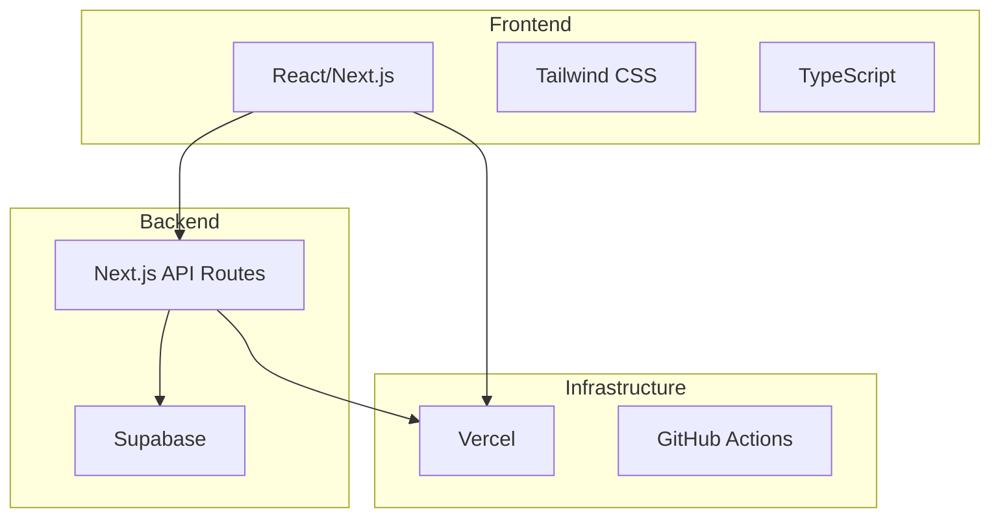

# Tech Stack Decision Matrix

> **Template cho việc lựa chọn công nghệ cho dự án**
> **Nguồn**: Trích xuất từ v0, Lovable, Windsurf, Antigravity

---

## Project Overview

| Field | Value |
|-------|-------|
| **Project Name** | [Tên dự án] |
| **Project Type** | [Web App / Mobile App / Desktop / API / Full-stack] |
| **Target Platform** | [Browser / iOS / Android / Cross-platform] |
| **Expected Scale** | [Small / Medium / Large / Enterprise] |
| **Timeline** | [Thời gian dự kiến] |
| **Team Size** | [Số lượng developers] |

---

## Requirements Analysis

### Functional Requirements
- [Requirement 1]
- [Requirement 2]
- [Requirement 3]

### Non-Functional Requirements
- **Performance**: [Mô tả yêu cầu performance]
- **Scalability**: [Mô tả yêu cầu scalability]
- **Security**: [Mô tả yêu cầu security]
- **Maintainability**: [Mô tả yêu cầu maintainability]

### Technical Constraints
- [Constraint 1]
- [Constraint 2]

---

## Tech Stack Categories

### 1. Frontend Framework

| Option | Pros | Cons | Score |
|--------|------|------|-------|
| **React** | ✅ Large ecosystem ✅ Component reusability ✅ Strong community | ❌ Boilerplate code ❌ Learning curve | 8/10 |
| **Next.js** | ✅ SSR/SSG built-in ✅ File-based routing ✅ API routes | ❌ Vendor lock-in ❌ Complex config | 9/10 |
| **Vue** | ✅ Easy to learn ✅ Great documentation ✅ Flexible | ❌ Smaller ecosystem ❌ Less job market | 7/10 |
| **Svelte** | ✅ No virtual DOM ✅ Less boilerplate ✅ Fast | ❌ Smaller community ❌ Fewer libraries | 7/10 |

**Decision**: [Framework được chọn]

**Rationale**: [Lý do chọn]

---

### 2. Backend Framework

| Option | Pros | Cons | Score |
|--------|------|------|-------|
| **Node.js + Express** | ✅ JavaScript full-stack ✅ Fast development ✅ Large ecosystem | ❌ Callback hell ❌ Single-threaded | 8/10 |
| **Next.js API Routes** | ✅ Same codebase ✅ Serverless ready ✅ Easy deployment | ❌ Limited for complex APIs ❌ Vendor lock-in | 7/10 |
| **Python + FastAPI** | ✅ Type safety ✅ Auto docs ✅ Fast | ❌ Different language ❌ Async complexity | 8/10 |
| **Go** | ✅ High performance ✅ Concurrency ✅ Compiled | ❌ Verbose ❌ Learning curve | 7/10 |

**Decision**: [Framework được chọn]

**Rationale**: [Lý do chọn]

---

### 3. Database

| Option | Type | Pros | Cons | Score |
|--------|------|------|------|-------|
| **PostgreSQL** | SQL | ✅ ACID compliant ✅ Rich features ✅ JSON support | ❌ Complex setup ❌ Scaling challenges | 9/10 |
| **MongoDB** | NoSQL | ✅ Flexible schema ✅ Horizontal scaling ✅ JSON native | ❌ No ACID (older versions) ❌ Memory intensive | 7/10 |
| **Supabase** | SQL (Postgres) | ✅ Auth built-in ✅ Real-time ✅ Easy setup | ❌ Vendor lock-in ❌ Limited customization | 8/10 |
| **Firebase** | NoSQL | ✅ Real-time ✅ Easy setup ✅ Auth included | ❌ Expensive at scale ❌ Vendor lock-in | 7/10 |

**Decision**: [Database được chọn]

**Rationale**: [Lý do chọn]

---

### 4. Styling Solution

| Option | Pros | Cons | Score |
|--------|------|------|-------|
| **Tailwind CSS** | ✅ Utility-first ✅ Fast development ✅ Small bundle | ❌ HTML clutter ❌ Learning curve | 9/10 |
| **CSS Modules** | ✅ Scoped styles ✅ No runtime ✅ Familiar CSS | ❌ More files ❌ Less dynamic | 7/10 |
| **Styled Components** | ✅ CSS-in-JS ✅ Dynamic styling ✅ Component-scoped | ❌ Runtime overhead ❌ SSR complexity | 7/10 |
| **Vanilla CSS** | ✅ No dependencies ✅ Full control ✅ Fast | ❌ No scoping ❌ More manual work | 6/10 |

**Decision**: [Styling solution được chọn]

**Rationale**: [Lý do chọn]

---

### 5. State Management

| Option | Pros | Cons | Score |
|--------|------|------|-------|
| **Redux Toolkit** | ✅ Predictable ✅ DevTools ✅ Middleware | ❌ Boilerplate ❌ Learning curve | 8/10 |
| **Zustand** | ✅ Simple API ✅ Small bundle ✅ No boilerplate | ❌ Less structure ❌ Smaller community | 8/10 |
| **React Context** | ✅ Built-in ✅ No dependencies ✅ Simple | ❌ Performance issues ❌ Prop drilling | 6/10 |
| **Jotai** | ✅ Atomic ✅ TypeScript first ✅ Simple | ❌ New library ❌ Smaller ecosystem | 7/10 |

**Decision**: [State management được chọn]

**Rationale**: [Lý do chọn]

---

### 6. Authentication

| Option | Pros | Cons | Score |
|--------|------|------|-------|
| **NextAuth.js** | ✅ Easy setup ✅ Multiple providers ✅ Secure | ❌ Next.js only ❌ Limited customization | 8/10 |
| **Supabase Auth** | ✅ Built-in ✅ Row-level security ✅ Magic links | ❌ Vendor lock-in ❌ Limited providers | 8/10 |
| **Auth0** | ✅ Enterprise-ready ✅ Many features ✅ Secure | ❌ Expensive ❌ Complex setup | 7/10 |
| **Custom (JWT)** | ✅ Full control ✅ No vendor lock-in ✅ Flexible | ❌ Security risks ❌ More work | 6/10 |

**Decision**: [Auth solution được chọn]

**Rationale**: [Lý do chọn]

---

### 7. Deployment & Hosting

| Option | Pros | Cons | Score |
|--------|------|------|-------|
| **Vercel** | ✅ Zero config ✅ Edge functions ✅ Preview deploys | ❌ Expensive at scale ❌ Vendor lock-in | 9/10 |
| **Netlify** | ✅ Easy setup ✅ Forms/Functions ✅ Good free tier | ❌ Limited backend ❌ Slower builds | 8/10 |
| **AWS** | ✅ Full control ✅ Scalable ✅ Many services | ❌ Complex ❌ Expensive ❌ Learning curve | 7/10 |
| **Docker + VPS** | ✅ Full control ✅ Cost-effective ✅ Portable | ❌ Manual setup ❌ Maintenance overhead | 6/10 |

**Decision**: [Hosting được chọn]

**Rationale**: [Lý do chọn]

---

## Final Tech Stack

### Core Stack

| Layer | Technology | Version | Rationale |
|-------|-----------|---------|-----------|
| **Frontend Framework** | [Tech] | [Version] | [Lý do] |
| **Backend Framework** | [Tech] | [Version] | [Lý do] |
| **Database** | [Tech] | [Version] | [Lý do] |
| **Styling** | [Tech] | [Version] | [Lý do] |
| **State Management** | [Tech] | [Version] | [Lý do] |
| **Authentication** | [Tech] | [Version] | [Lý do] |
| **Hosting** | [Tech] | [Version] | [Lý do] |

### Supporting Tools

| Category | Tool | Purpose |
|----------|------|---------|
| **Package Manager** | [pnpm/npm/yarn] | [Lý do] |
| **Build Tool** | [Vite/Webpack/Turbopack] | [Lý do] |
| **Testing** | [Vitest/Jest] | [Lý do] |
| **Linting** | [ESLint] | [Lý do] |
| **Formatting** | [Prettier] | [Lý do] |
| **CI/CD** | [GitHub Actions] | [Lý do] |
| **Monitoring** | [Sentry/LogRocket] | [Lý do] |

---

## Decision Criteria Weights

| Criteria | Weight | Justification |
|----------|--------|---------------|
| **Developer Experience** | 25% | [Giải thích] |
| **Performance** | 20% | [Giải thích] |
| **Scalability** | 20% | [Giải thích] |
| **Cost** | 15% | [Giải thích] |
| **Community & Support** | 10% | [Giải thích] |
| **Learning Curve** | 10% | [Giải thích] |

---

## Risk Assessment

| Risk | Probability | Impact | Mitigation |
|------|-------------|--------|------------|
| [Risk 1] | High/Medium/Low | High/Medium/Low | [Strategy] |
| [Risk 2] | High/Medium/Low | High/Medium/Low | [Strategy] |

---

## Migration Path (if applicable)

### From Current Stack
- **Current**: [Tech stack hiện tại]
- **Target**: [Tech stack mới]

### Migration Strategy
1. [Step 1]
2. [Step 2]
3. [Step 3]

### Timeline
- **Phase 1**: [Timeline]
- **Phase 2**: [Timeline]
- **Phase 3**: [Timeline]

---

## Team Readiness

| Technology | Team Expertise | Training Needed | Timeline |
|------------|----------------|-----------------|----------|
| [Tech 1] | High/Medium/Low | Yes/No | [Timeline] |
| [Tech 2] | High/Medium/Low | Yes/No | [Timeline] |

---

## Cost Estimation

### Development Costs
- **Licenses**: $[amount]
- **Tools**: $[amount]
- **Training**: $[amount]

### Operational Costs (Monthly)
- **Hosting**: $[amount]
- **Database**: $[amount]
- **Third-party Services**: $[amount]
- **Total**: $[amount]/month

### Scaling Costs (Projected)
- **At 1K users**: $[amount]/month
- **At 10K users**: $[amount]/month
- **At 100K users**: $[amount]/month

---

## References

### Documentation
- [Link 1]: [Description]
- [Link 2]: [Description]

### Benchmarks
- [Benchmark 1]: [Results]
- [Benchmark 2]: [Results]

### Case Studies
- [Company 1]: [Tech stack used]
- [Company 2]: [Tech stack used]

---

**Decision Date**: [YYYY-MM-DD]
**Review Date**: [YYYY-MM-DD]
**Approved By**: [Names]
